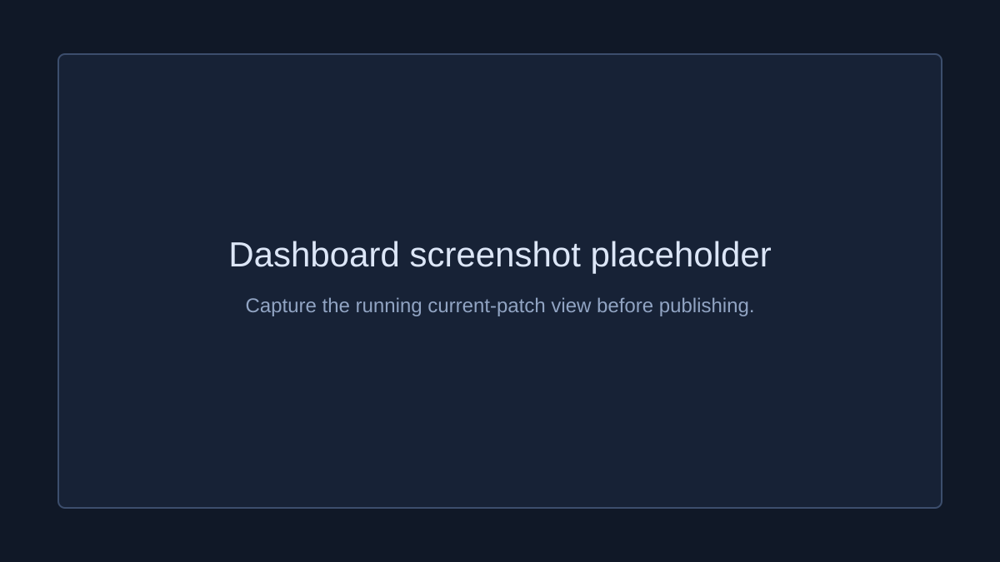
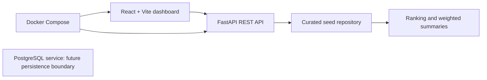

# TFT Meta Analytics

TFT Meta Analytics is a portfolio dashboard for comparing Teamfight Tactics composition performance. It presents filterable composition rankings, weighted aggregate metrics, and patch trends through a React frontend and FastAPI API.

Version 1 intentionally uses curated, static aggregate mock data. It needs no Riot API key and does not implement live Riot API ingestion, accounts, real-time tracking, or an agent chat feature.

## Screenshots



Replace this placeholder with a local dashboard capture after running the stack and before publishing the project portfolio.

## Architecture



- `apps/web`: React + TypeScript dashboard, filters, ranking table, and trend chart.
- `apps/api`: FastAPI routes, Pydantic response models, seed repository, and analytics functions.
- `apps/api/app/seed_data.py`: curated patch, composition, and aggregate-stat rows used by Version 1.
- `docker-compose.yml`: local web, API, and PostgreSQL service wiring. The current API serves seed data; PostgreSQL is retained as the migration boundary for a future importer.

## Data Model And Metrics

The intended relational schema has `patches`, `compositions`, `units`, `traits`, `items`, relationship tables for each composition, and `composition_stats`. A stat row is an aggregate for one composition, patch, region, and rank tier with games, placement, top-four, win, and pick rates.

The dashboard opens on the current patch. Current-patch seed rows use the same `OC1` and `Diamond+` cohort across all compositions, so the default ranking is comparable. Trend queries keep the selected region, rank, and playstyle filters but deliberately span every patch release.

Composition ranking uses one documented formula:

```text
placement_score = max(0, (8 - average_placement) / 7)
meta_score = placement_score * 40 + top_four_rate * 30
             + win_rate * 1.5 * 20 + min(pick_rate, 0.2) / 0.2 * 10
```

Meta-summary top-four and win rates are weighted by `games`, rather than averaging composition rates equally.

## Local Development

Run the complete local development stack:

```bash
docker compose up --build
```

- Web: `http://localhost:5173`
- API: `http://localhost:8000`
- API docs: `http://localhost:8000/docs`

For running services outside Docker, start the API in one terminal:

```bash
cd apps/api
python -m pip install -e .
uvicorn app.main:app --reload --port 8000
```

Start the dashboard in another:

```bash
cd apps/web
npm install
VITE_API_BASE_URL=http://localhost:8000 npm run dev
```

For a separately hosted frontend, configure the API with a comma-separated allowlist. Local Vite origins remain the default when this variable is omitted.

```bash
CORS_ALLOWED_ORIGINS=https://your-dashboard.vercel.app,https://preview.example.com
```

## API Examples

```bash
curl http://localhost:8000/patches
curl 'http://localhost:8000/comps?patch=14.15&sort=win_rate'
curl 'http://localhost:8000/stats/meta?patch=14.15'
curl 'http://localhost:8000/stats/trends/rebel-fast-8?patch=14.15&region=OC1&rank_tier=Diamond%2B'
```

The final trend request returns all available patches for the selected composition while using the supplied region and rank cohort. API responses are derived only from the local curated data.

## Testing

```bash
cd apps/api && python -m pytest -v
cd apps/web && npm test
cd apps/web && npm run build
```

## Deployment Path

The chosen deployment path is a Vercel static frontend connected to a Render FastAPI web service. Set `VITE_API_BASE_URL` on Vercel to the Render API URL and set `CORS_ALLOWED_ORIGINS` on Render to the Vercel deployment URL. This repository does not claim a live deployment or a live Riot data feed.

## Roadmap

1. Add a separate Riot TFT match-data pipeline that normalises match JSON and writes aggregate data to PostgreSQL.
2. Replace the seed repository with PostgreSQL queries while retaining the current API contracts.
3. Add an insight layer over stored dashboard data for meta questions, keeping it distinct from live tracking and authentication work.
