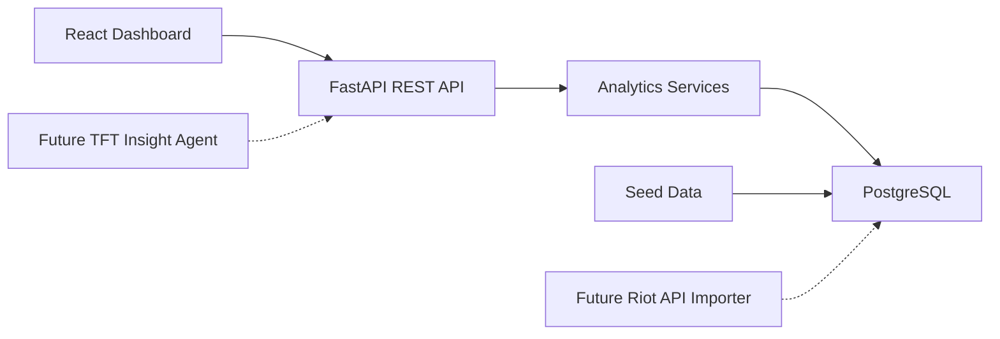

# TFT Meta Analytics Dashboard Design

## Goal

Build a portfolio-ready full-stack data analytics project for Australian full-stack and AI-adjacent developer roles. The project presents Teamfight Tactics meta statistics through a React dashboard backed by a FastAPI API and PostgreSQL data model.

The first version uses curated static and mock match-aggregate data so the product can be completed, tested, deployed, and shown on GitHub without depending on a Riot production API key. The architecture keeps clear extension points for a future Riot API importer, ETL pipeline, and TFT insight agent.

## Target Audience

The primary audience is a hiring manager or technical interviewer reviewing a junior-to-mid full-stack candidate portfolio. They should quickly see evidence of:

- React and TypeScript dashboard development
- FastAPI REST API design
- PostgreSQL schema design
- Data modelling and aggregation
- Docker-based local development
- Practical product thinking around filters, charts, empty states, and deployment

## Product Scope

### In Scope

- Meta overview page with ranked composition cards and key statistics
- Composition detail page with units, traits, items, playstyle notes, and trends
- Filters for patch, region, rank tier, and playstyle
- Trend charts showing composition performance across patches
- FastAPI endpoints for compositions, composition details, patches, and meta summary
- PostgreSQL schema for patches, compositions, units, traits, items, and aggregate stats
- Seed data that resembles realistic TFT meta data
- Docker Compose setup for frontend, backend, and database
- README with local setup, architecture diagram, screenshots, and roadmap
- Tests for key backend services and API responses

### Out of Scope For Version 1

- Live Riot API ingestion
- Riot Sign On
- User accounts
- Real-time match tracking
- Agent chat interface
- Mobile app wrapper
- Paid or monetized functionality

These are intentionally out of scope to keep the first release small enough to finish and polish.

## User Experience

### Meta Overview

The landing screen is the working product, not a marketing page. It shows:

- Current selected patch
- Total analysed games from the seeded dataset
- Top compositions ranked by a composite score
- Key metrics: average placement, top-four rate, win rate, pick rate, and games analysed
- Filter controls for patch, rank tier, region, and playstyle
- Sort controls for average placement, win rate, top-four rate, and popularity

Each composition card links to its detail page.

### Composition Detail

The detail page shows:

- Composition name and short summary
- Core units with costs and roles
- Active traits and breakpoints
- Recommended core items
- Suggested level and reroll timing
- Strengths, weaknesses, and difficulty
- Metric summary for the selected filters
- Trend chart across recent patches

The detail page should read like a data product rather than a guide copied from a wiki. Notes should be generated from the local seed data and maintained in the project.

### Empty And Loading States

The UI includes professional loading and empty states:

- Loading skeletons while API data is being fetched
- Empty state when filters return no compositions
- Error state when the backend is unavailable

## Architecture

The project is a small monorepo:

```text
tft-meta-analytics/
  apps/
    api/
      app/
      tests/
    web/
      src/
  packages/
    seed-data/
  docker-compose.yml
  README.md
```

The frontend calls the backend API. The backend reads from PostgreSQL through a structured data-access layer. Seed data is loaded into the database during local setup.



## Backend Design

### API Endpoints

- `GET /health` returns service status
- `GET /patches` returns available patches
- `GET /comps` returns filtered and sorted composition summaries
- `GET /comps/{comp_id}` returns one composition with units, traits, items, notes, and stats
- `GET /stats/meta` returns aggregate dashboard metrics for the selected filters
- `GET /stats/trends/{comp_id}` returns patch-by-patch trend data for one composition

### Data Model

Core tables:

- `patches`: patch id, display name, release date, current flag
- `compositions`: name, slug, playstyle, difficulty, summary
- `units`: name, cost, role, image key
- `traits`: name, breakpoint text, image key
- `items`: name, category, image key
- `composition_units`: composition-unit relationship with priority and recommended star level
- `composition_traits`: composition-trait relationship with active tier
- `composition_items`: composition-item relationship with priority and holder unit
- `composition_stats`: patch, region, rank tier, games, average placement, top-four rate, win rate, pick rate

The schema is designed around aggregate analytics. Raw match storage is deferred to a future pipeline project.

### Analytics Logic

The backend calculates:

- Composite meta score for ranking compositions
- Filtered summary metrics
- Trend series by patch
- Sort order based on selected metric

The composite score is deterministic and documented in code so an interviewer can understand and challenge it.

## Frontend Design

### Pages

- `/` meta overview dashboard
- `/comps/:slug` composition detail page

### Components

- Filter bar
- Metric cards
- Composition ranking table or card list
- Composition detail header
- Unit, trait, and item lists
- Trend chart
- Loading, empty, and error states

The visual style should be clean and product-like: dense enough for data scanning, with TFT-inspired accent colours used sparingly.

## Testing Strategy

Backend tests:

- Health endpoint
- Composition list filtering
- Composition detail response shape
- Meta summary calculation
- Trend endpoint output order

Frontend tests:

- Dashboard renders fetched composition data
- Filter changes update API query parameters
- Empty state appears for no results

Manual verification:

- Run the full Docker Compose stack locally
- Confirm seeded data loads
- Confirm frontend can navigate from overview to detail
- Capture screenshots for README

## Deployment

The preferred initial deployment is:

- Frontend on Vercel, Netlify, or Render static hosting
- Backend and PostgreSQL on Render, Railway, or Fly.io

The README will document the chosen deployment path after implementation. Environment variables must keep database URLs and future Riot API keys out of source control.

## GitHub Presentation

The repository should include:

- Clear README summary
- Tech stack badges or concise stack section
- Screenshots or short GIF
- Architecture diagram
- Local setup commands
- API endpoint examples
- Database schema explanation
- Testing instructions
- Roadmap for Riot API importer, ETL pipeline, and TFT Insight Agent

## Roadmap

### Project 2: TFT Match Data Pipeline

Build a backend/data project that ingests Riot TFT match JSON, normalises units, traits, items, and placements, and writes aggregate statistics into PostgreSQL.

### Project 3: TFT Insight Agent

Build a lightweight agent that answers meta questions using retrieved dashboard data, such as which compositions are stable for climbing or which items are most flexible in the current patch.

## Success Criteria

Version 1 is successful when:

- The app runs locally with one command through Docker Compose
- The dashboard shows meaningful seeded TFT meta data
- Filters and sorting work
- Composition detail pages provide useful analytics
- Backend tests pass
- The README makes the project understandable to a recruiter or interviewer within two minutes
- The project can be deployed and linked from a resume
